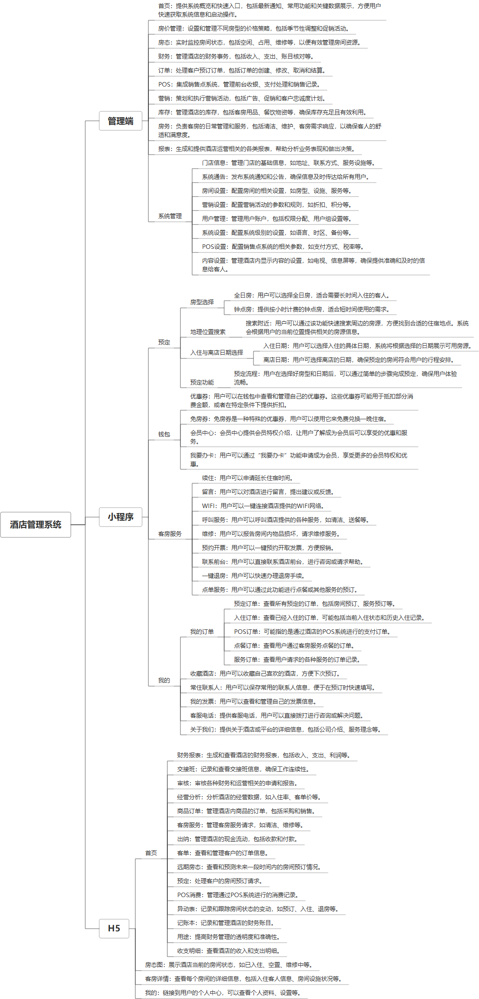

 

    
 

公司拥有上百套具有自主知识产权的软件系统，详情请查看码云首页或公司官网

 
<h1>酒店管理系统SaaS版</h1>

<a href="https://www.haishi.net.cn/">公司官网</a> ｜ <a href="https://www.haishi.net.cn/">在线体验</a>

 

## 系统介绍

支持多酒店管理，包含多端，功能包含：首页
房间管理
房态
财务
订单
POS
营销
库存
房务报表
系统管理

None
                

## 系统功能介绍

### 系统包含终端说明

管理端（WEB）

管理端（WEB）
| 序号 | 模块                    | 模块说明 |
| ---- | ----------------------- | -------- |
| 1    | FWY-JDGL-SAAS-MP        | 小程序   |
| 2    | FWY-JDGL-SAAS-SERVER    | 服务端   |
| 3    | FWY-JDGL-SAAS-H5        | H5端     |
| 4    | FWY-JDGL-SAAS-ZH-MANAGE | 管理端   |
| 5    | FWY-JDGL-SAAS-MANAGE    | 管理端   |

### 系统功能结构

### 系统功能说明

- 房价管理
- 房态管理
- 财务管理
- 订单管理

## 系统主要界面

## 系统技术说明

### 代码模块说明

| 序号 | 目录                                    | 目录说明 |
| ---- | --------------------------------------- | -------- |
| 1    | FWY-JDGL-SAAS-SERVER/hotel-saas-backend | --       |

### 系统技术选型

#### 开发语言/框架

JAVA（JDK1.8）
前端框架：VUE2
系统结构：单体应用

#### 服务中间件

Nginx
Tomcat

#### 数据库

MySQL（5.7+）

#### 其他说明

无

## 系统演示/商用

请扫码添加客服微信获取演示地址和系统详细资料。

如果您想基于酒店管理系统SaaS版进行商业化交付或定制开发服务，我们提供有偿的技术服务支持，合作模式不限，欢迎沟通！

公司官网地址： <a href="https://www.haishi.net.cn/">https://www.haishi.net.cn</a>

联系客服获取专业回答。

## 使用须知

1、 本项目商用必须获得版权所有者的授权。

2、 未经允许本项目代码不允许二次出售。

